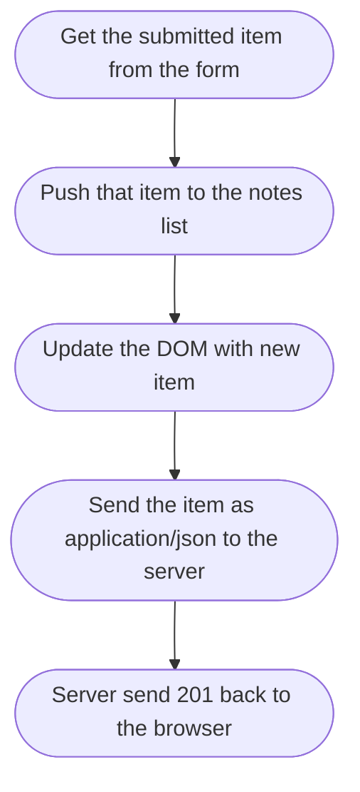

```mermaid
flowchart TD
    id1([Get the submitted item from the form]) --> id2([Push that item to the notes list]);
    id2([Push that item to the notes list]) --> id3([Update the DOM with new item]);
    id3([Update the DOM with new item]) --> id4([Send the item as application/json to the server]);
    id4([Send the item as application/json to the server]) --> id5([Server send 201 back to the browser]);
```